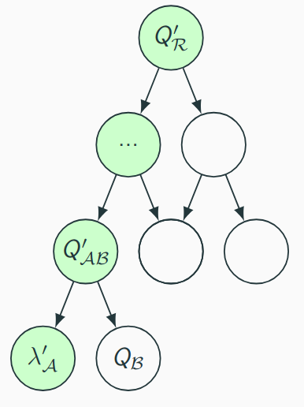

# Project M

> Disclaimer: this README file is updated often so it might change according to research process

Project structure:
- `notes` - various notes about research process
- `misc` - various prototypes (IBBE with sage, gossipsub with go)
- `papers` - research papers, that the most actual version of messenger [whitepaper]
- `src` - rust implementation of messenger primitives:
  - `hibbe` - hybrid IBBE with ART implementation
  - `zk` - ART zk proofs implementation
  - `chat_node` - experimantal libp2p messenger node

## Main idea

The main goal of the project is developing of distributed/federated messanger with features:

- support of p2p chats (with Signal protocol)
- support of large groups (> 1000 members) with custom [ART]-based protocol
- advanced identity management (with different identity modes)
- service provider intentionally does not know user identities (however, optional directory service does)
- mostly all user operations is provable so that service providers are mostly trustless entities that simply route users' messages
- e2e encryption by default in p2p and group modes

## Encryption

For p2p chats we propose to use [Signal] protocol, for p2g(*peer-to-group*) we use custom [PM25] proto which is heavily based on [ART]. Key feature of our proto is provability of
each group operation so that every member can assure integrity and validity of a current group state.

### ART

> Here we briefly describe our protocol. Full description can be found at [PM25]

Let $`\langle P \rangle = \mathbb{G}`$ - cyclic (abstract) group written additively of order $q$. $`S`$ - a set of group members, $`\epsilon \in S`$ - blank group member.

A group is represented as an Asynchronous Ratcheting Tree (can be seen as a binary tree) where each node containts public key $`Q^e_{j} = [\lambda_{j}]P, j \in S^{*}`$, especially each leaf node is occupied by some group member $`i \in S`$ with public key $`Q^e_i`$.
Let $`\iota: \mathbb{G} \to \mathbb{Z}_{q}`$ - hash function. Secret key $`\lambda_{ij}`$ corresponding to public key $`Q_{ij}`$ of parent of nodes $i$ and $j$ is obtained as $`\lambda_{ij} = \iota([\lambda_{i}]Q_{j}) = \iota([\lambda_{j}]Q_{i})`$ and could be seen as a result of Diffie-Hellman secret sharing between $i$ and $j$.
A secret key in a root of the tree $`\lambda_{S}`$ is considered as shared group secret from which stage key $sk$ is derived. $sk$ is then used to derive message encryption and decryption symmetric keys. Symmetric keys is than rotated according to [symmetric ratchet] protocol.
An ART should be updated regularly to provide forward and post-compromise secrecy. Each ART update (obviously including all tree structure changing operations: `InitGroup, AddMember, RemoveMember` and regular key rotation) is supplemented with *update correctness proof*.

### Update correctness proof



For $j$-th($j \neq 0$) level of ART a group member $i \in S$ shall prove the following relation:
```math
\mathcal{R}^{(j)}_{\mathcal{ART}}=\{ (Q'_{\mathcal{A}},Q_\mathcal{B},Q'_{\mathcal{AB}}; \lambda'_{\mathcal{AB}},\lambda'_{\mathcal{A}}) | Q'_{\mathcal{A}}=[\lambda'_{\mathcal{A}}]P, \lambda'_{\mathcal{AB}}=\iota([\lambda'_{\mathcal{A}}]Q_{\mathcal{B}}), Q'_{\mathcal{AB}}=[\lambda'_{\mathcal{AB}}]P\}
```
Where $`\lambda_{\mathcal{A}}`$ - current level secret, $`\lambda^\prime_{\mathcal{A}}`$ - new current level secret, $`Q_{\mathcal{B}}`$ - reciprocal node's public key, $`\lambda'_{\mathcal{AB}}`$ - new next level secret, $`Q'_{\mathcal{AB}}`$ - new next level public key.

Special case when $j=0$:
```math
\mathcal{R}^{(0)}_{\mathcal{ART}}=\{ (Q'_{\mathcal{A}},Q_\mathcal{B},Q'_{\mathcal{AB}}; \lambda'_{\mathcal{AB}},\lambda'_{\mathcal{A}}) | Q^{c}_i=[k_{c,i}]P, Q_{\mathcal{A}}=[\lambda_{\mathcal{A}}]P, Q'_{\mathcal{A}}=[\lambda'_{\mathcal{A}}]P, \lambda'_{\mathcal{AB}}=\iota([\lambda'_{\mathcal{A}}]Q_{\mathcal{B}}), Q'_{\mathcal{AB}}=[\lambda'_{\mathcal{AB}}]P\}
```

A proof of update correctness is composed by chaining $`\mathcal{R}^{(j)}_{\mathcal{ART}}`$ proofs with the same transcript for $`j=0..\ell`$ where $\ell$ is three depth.

#### Proving $`R_{\iota}`$

Let define the subrelation $`R_{\iota}`$:
```math 
R_{\iota} = \{ (Com({\lambda_{\mathcal{B}}}), Com({\lambda_{\mathcal{AB}}}); \lambda_{\mathcal{A}}, \lambda_{\mathcal{AB}}) | \lambda_{\mathcal{AB}}=\iota([\lambda_{\mathcal{A}}]Q_{\mathcal{B}})\}
```
Where $`Q_{\mathcal{B}} \in \mathbb{G}, Com(k) = [k]P + [r]H \in \mathbb{G}_2`$ - binding Pedersen commitment for $k$.
We have presented a [argument system] for the relation $`\mathcal{R}_{\iota}`$ where $`\iota(P)=x(P)`$ - affine $x$-coordinate of $P$ using [bulletproofs], reference implementation for $`\mathcal{R}_{\iota}`$ part can be found in `src/zk`.
> It is important to stress that commonly $\mathbb{G}$ is an elliptic curve group $E(\mathbb{F}_q)$ where $q=|\mathbb{G}_2|$

One might ask how to prove $`R_{\iota}`$ efficiently. Usage of classic Schnorr $\Sigma$ proofs is not efficient because $\iota$ is a non-linear function. Instead we propose to use [bulletproofs] because it allows us to prove relations abouts commited witnesses.
For proving scalar multiplication result we use optimized technique without usage of expensive point addition and multiplication.

0. Define high-level witness variables $`\mathbf{k} \gets \lambda_{\mathcal{A}}, \mathbf{s} \gets \lambda_{\mathcal{AB}}`$
1. Define low-level witness variables $`\mathbf{a}_i, \mathbf{b}_i`$ from bit-decomposition of 
```math
\lambda_{\mathcal{A}} = \sum_{i=0}^{n-1} k_i 2^i, \mathbf{a}_i \gets k_i, \mathbf{b}_i \gets (1 - k_i)
```
2. For each bit $i$ add quadratic constraint $`\mathbf{a}_i \cdot \mathbf{b}_i = 0`$ and linear constraint: $`\mathbf{b}_i = 1 - \mathbf{a}_i`$
3. Add linear constraint $`\sum_{i=0}^{n-1} \mathbf{a}_i 2^i = \mathbf{k}`$
4. Define sequence $`\{c_i\}_{i=0}^{n-1} \subset \mathbb{N}^n`$ such that $`\sum_{i=0}^{n-1} c_i = 0`$, for example 
```math
c_0 = 2, \forall i \in \{ 1, \dots, n-2 \}: c_{i}=c_{i-1} +1, c_{n-1}=-\frac{n^2 + n - 2}{2}
```
5. Let $G \in \mathbb{G}$, Define sequence $`\{\Delta_i\}_{i=0}^{n-1}`$ as $`\Delta_i = [k_i]([2^i]Q_{\mathcal{B}})+[c_i]G`$ so that each $\Delta_i$ takes value $`\Delta_i^{(0)} = [c_i]G`$ or $`\Delta_i^{(1)} = [2^i]Q_{\mathcal{B}} + [c_i]G`$. 
6. Denote partial sum $`P_j=\sum_{i=0}^{j} \Delta_i`$ so that $`P_{i+1} = P_i + \Delta_i`$ and $`P_{n-1}=\sum_{i=0}^{n-1} \Delta_i=[\lambda_{\mathcal{A}}]Q_{\mathcal{B}}`$.
7. Constraint starting point $P_0$:
    - add low level variables:
       
       $`\mathbf{x}_0 \gets \mathbf{a}_0 \cdot (x_{\Delta_0^{(1)}} - x_{\Delta_0^{(0)}}) + x_{\Delta_0^{(0)}}, \mathbf{y}_0 \gets \mathbf{a}_0 \cdot (y_{\Delta_0^{(1)}} - y_{\Delta_0^{(0)}}) + y_{\Delta_0^{(0)}}`$
    - add linear constraints $`x_0 = x_{P_0}, y_0 = y_{P_0}`$
8. For each $i=1..n-1$:
    - add low-level variables with linear constraints:
      
      $`\mathbf{x}_i \gets k_i \cdot (x_{\Delta_i^{(1)}} - x_{\Delta_i^{(0)}}) + x_{\Delta_i^{(0)}}, \mathbf{y}_i \gets k_i \cdot (y_{\Delta_i^{(1)}} - y_{\Delta_i^{(0)}}) + y_{\Delta_i^{(0)}}`$
    - add low-level variables with 3 quadratic constraints:
    
      $`\mathbf{x}_i^2 \gets \mathbf{x}_i \cdot \mathbf{x}_i, \mathbf{x}_i^3 \gets \mathbf{x}_i^2 \cdot \mathbf{x}_i, \mathbf{y}_i^2 \gets \mathbf{y}_i \cdot \mathbf{y}_i`$
    - check $`P_i \in E(\mathbb{F}_q)`$ via linear constraint: $`\mathbf{y}_i^3 = \mathbf{x}_i^3 + a\mathbf{x}_i +b`$
    - check that $`P_i = P_{i-1} + \Delta_i`$ so that points $`-P_i,P_{i-1},\Delta_i`$ are co-linear by adding constraints(2 quadratic and 1 linear):
      
      $`\mathbf{t}_1 \gets (\mathbf{y}_{i-1}+\mathbf{y}_i) \cdot (x_{\Delta_i} - \mathbf{x}_i), \mathbf{t}_2 \gets (y_{\Delta_i}+\mathbf{y}_i) \cdot (\mathbf{x}_{i-1} - \mathbf{x}_i), \quad \mathbf{t}_1 = \mathbf{t}_2`$
9. Add final linear constraint: $`\mathbf{x}_{n-1} = \mathbf{s}`$

### Permission system

We propose the following roles for permission system:
- **member** - regular group member without auxiliary permissions
- **owner** - creator of the group that could endure any operation in group
- **admin** - group member with special credential issued by other admin or owner

We propose to use anonymous [credentials] for managing group permissions. One such scheme could be derived from [BBS] provable signatures. This credential could be issued by eligable entities(owner or admin) for new admins so that they could prove eligibility to the SP. Efficient credential management and revocation is a subject for further research.

### Group operations

#### InitGroup

The group **owner** initiates a group by generating an *ART* with authentically encrypted for other group members leaves containing initial key material $`\mathsf{AENC}(ikm_{i},d_{owner},Q^{inv}_i)`$. One known AENC scheme is [hybrid] encryption. For public key encryption the owner uses invitational keys $`Q^{inv}_i`$ published and signed by respective users and possibly stored by directory service.
 
#### AddMember
`TODO`

#### RemoveMember
`TODO`

## Network architecture

The project supports two major types of network architecture: *federated* and *full distributed*

### Federated

Federated architectures is supposed to be run in conventional *web2* setting. 

Main actors: 
- Service provider (SP):
  - Set of operational nodes
  - Message broker (for MVP [kafka] is proposed)
  - Optional directory service containing set of user and group identities
- User that connects to service provider via PC/mobile client

It's important to say that service provider barely delivers messages accross system and does not interfere with user identities nor any encrypted traffic.

#### Group management 

Each group has unique identifier `GID` known to SP. This GID identifies topic on messege broker containing all encrypted group events, messages and metadata. Authorized users are granted with read/write permissions to that topic.

#### Authorization

Each user connecting to SP shall authorize his access providing valid zk-proof of possesion to a list of groups, SP validates the proof and issues authorization token granting access to specific topics on message broker.

### Full decentralized

Fully decentralized architecture for future *web3* setting or modern IOT mesh networks(over some radio physical layer):

The system is consist of *operational nodes* connected with each other, each node handle shared state and DHT

## Identity

Let $\mathbb{G}_2$ - cryptographic pairing-friendly group. Each user of the system $`i \in S`$ is represented with his identity secret key $`d_{i}`$ along with a public key $`Q^{id}_i = [d_{i}]P \in \mathbb{G}_2`$ and auxiliary metadata $u_i$. Optinally $`Q^{id}_i`$ could be given to directory service that issues user's public key and metadata to X.509 certificate that could be obtained by the others. 

Each user maintains fresh list of signed invitational public keys $`(Q^{inv}_i,\mathsf{Sign}(d_{i},Q^{inv}_i))`$ used for invitation to groups.

For each group chat $c$ user $i \in S$ generates new chat secret key $`k_{c,i}`$ and public key $`Q^{c}_i=[k_{c,i}]P \in \mathbb{G}`$ acting as per-chat user identifier.

Several modes of preserving identity is [proposed] for every user:
- anonymous capybara - user only computes valid MAC tag to every group message so that other members can verify that he knows $sk$ but do not know any identity attributes.
- traceble elephant - user proves that he posseses only his leaf key $\lambda_i$ and chat key $`Q^{c}_i=[k_{c,i}]P`$ signing each message with this keys.
- public alligator - user proves he posseses his identity key $d_i$ signing each message with it

[Project M research paper by Illia and Serhii, 2024]: papers/Messenger.pdf
[proposed]: https://github.com/distributed-lab/papers/blob/main/in-da-club/In_Da_Club.pdf
[PM25]: https://www.overleaf.com/project/679b4c7dcc8fd2d1052f5849
[whitepaper]: https://www.overleaf.com/project/679b4c7dcc8fd2d1052f5849
[Signal]: https://signal.org/docs/
[ART]: https://eprint.iacr.org/2017/666.pdf
[Kafka]: https://kafka.apache.org/
[symmetric ratchet]: https://signal.org/docs/specifications/doubleratchet/#symmetric-key-ratchet
[argument system]: https://github.com/juja256/zkp/blob/main/sigma_cross.pdf
[bulletproofs]: https://crates.io/crates/bulletproofs
[DID]: https://www.w3.org/TR/did-1.0/
[credentials]: https://www.w3.org/TR/vc-data-model-2.0/
[BBS]: https://identity.foundation/bbs-signature/draft-irtf-cfrg-bbs-signatures.html#BBS04
[hybrid]: https://datatracker.ietf.org/doc/rfc9180/